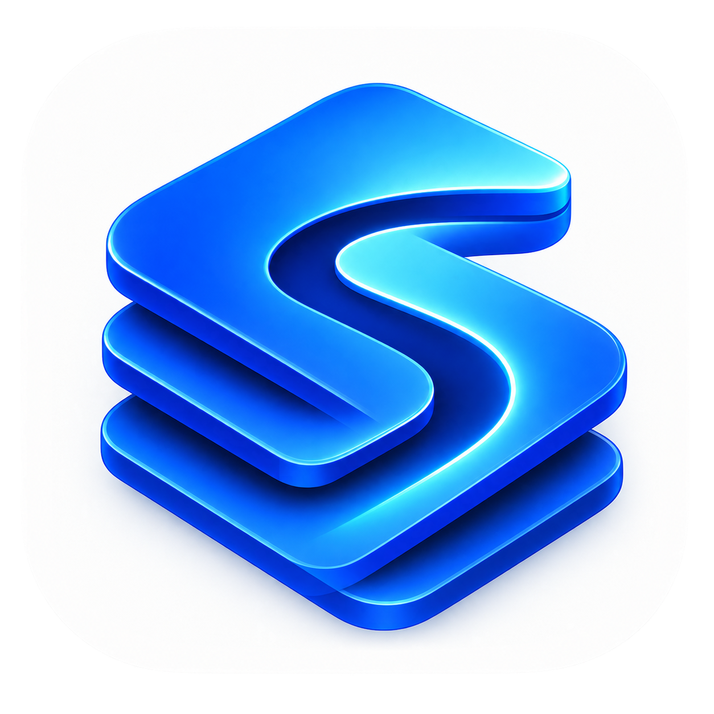
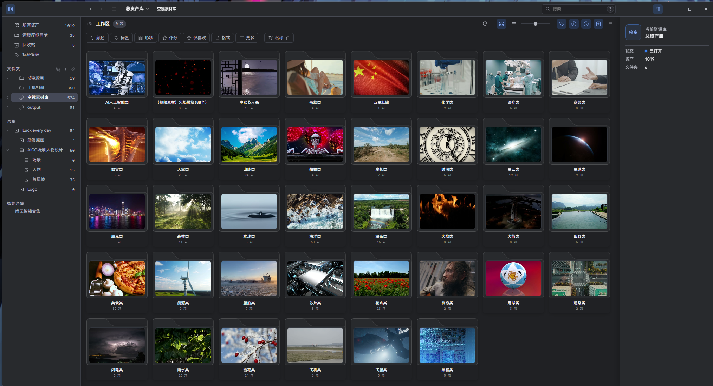

<div align="center">

**English** | [简体中文](README.md)

</div>

# Super

<div align="center">



</div>

Super is a local-first visual asset workspace for creative work. It brings imports, browsing, search, tags, collections, previews, linked folders, browser capture, AI analysis, and local sync into one desktop application.

## Distribution status

Super is proprietary software. This repository is for authorized development, builds, verification, and version management; it is not a public source-distribution or update channel. The project team distributes installers, extension packages, and access separately.

## Highlights

- **Multiple asset types**: manage images, video, audio, 3D models, text, and other recognized files. Unsupported preview types can still be catalogued and opened externally.
- **Organization and discovery**: folders, tags, ratings, favorites, descriptions, palettes, collections, filters, sorting, and full-text search within the current scope.
- **Local first**: managed imports copy assets into a library, while linked folders reference an external directory in place. Library data stays local and can be synchronized between devices through WebDAV when needed.
- **Browsing and preview**: thumbnails, video previews, metadata, the viewer, and background derivative work are designed not to block browsing.
- **Automation and extensibility**: plugins, controlled automation scripts, and local MCP connections are supported. Writes are bounded by permissions, execution plans, and risk confirmation.
- **AI analysis**: supported media can receive descriptions, tags, and structured information. Assets are sent to a selected service only after the user explicitly configures and enables it.
- **External libraries and browser capture**: supported external libraries can be opened directly; the browser extension saves web images and video into the currently open Super library.

<div align="center">



</div>

## Install and use

Install Super only from a package supplied by the project team. Windows builds produce `SuperSetup.exe` by default. Libraries and user configuration are outside the application directory, so upgrading or uninstalling the app does not automatically remove libraries.

For installation, import, browsing, sync, AI, extension, and troubleshooting guidance, see the [user guide](docs/user-guide/README.en.md).

## Build locally

Node.js 24 is required (see `.nvmrc`). Native development targets macOS arm64 and Windows x64; do not build from an SMB/NAS-mounted path.

```bash
npm ci --registry=https://registry.npmjs.org
npm run rebuild:native
npm start
```

Common verification and packaging commands:

```bash
npm run lint
npm run typecheck
npm run test
npm run test:e2e
npm run package
npm run make:inno
```

On Windows, `npm run make:inno` creates `out/make/inno/SuperSetup.exe`. Repository scripts and the [extension author manual](docs/manual/README.md) define the current build, delivery, and extension boundaries.

## Documentation

| Document | Content |
| --- | --- |
| [User guide](docs/user-guide/README.en.md) | Install, import, browse, search, tags, collections, sync, AI, browser extension, and troubleshooting |
| [Extension author manual](docs/manual/README.md) | Plugin, automation-script, and MCP development guides and API references |
| [Product brief](docs/product-brief.md) | Product vision, scope, terminology, and delivery boundaries |
| [Glossary](docs/glossary.md) | Definitions for libraries, automation, plugins, sync, and more |
| [Release notes](release-notes-0.1.4.md) | Recent capabilities, reliability improvements, and known limitations |

License notices for third-party components, media runtimes, and assets are in [THIRD_PARTY_NOTICES.md](THIRD_PARTY_NOTICES.md) and the license files shipped with each component.
