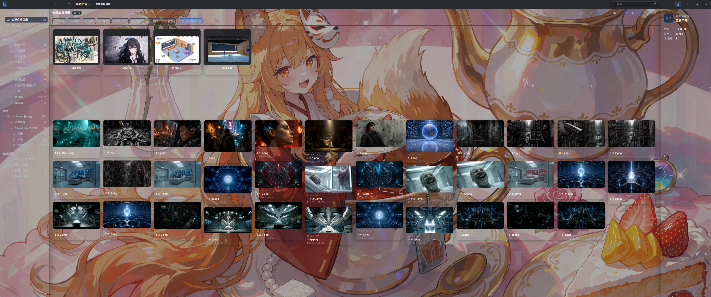

<div align="center">

[English](README.en.md) | **简体中文**

</div>

# Super Lib

<div align="center">


</div>

Super Lib 是一款完全免费的本地素材管理应用。把图片、视频、音频和模型放进一个工作区，用文件夹、标签、颜色筛选与合集整理素材，也可以按需配置 AI 分析和自己的界面外观。

[下载 Windows 安装包](https://github.com/aimtowin/Super/releases/latest/download/SuperSetup.exe) · [查看版本与其他下载文件](https://github.com/aimtowin/Super/releases/latest) · [快速上手](docs/user-guide/quick-start.md) · [反馈问题](https://github.com/aimtowin/Super/issues)



## 从一个本地资产库开始

1. 下载并安装 `SuperSetup.exe`，打开 Super Lib。
2. 在本机磁盘中选择位置创建资产库，建议使用固态硬盘，并为素材与预览缓存留出空间。
3. 按需在「设置 → AI」配置 AI 服务，在「设置 → 外观」调整主题、背景与字体大小。这两步都可以跳过。
4. 导入素材或链接已有文件夹，开始浏览、筛选和整理。

应用本身完全免费。可选的第三方 AI 服务可能另行收费，费用由所选服务商决定。

## 功能概览

- **多类型资产**：管理图片、视频、音频、3D 模型、文本及其他可识别文件；不支持内置预览的文件仍可纳入资源库并通过外部应用打开。
- **组织与发现**：文件夹、标签、评分、喜欢、描述、色卡、合集、过滤、排序和范围内全文检索。
- **本地优先**：托管导入会复制素材进入资源库；链接文件夹则原位引用外部目录。资源库数据保存在本机，可按需使用 WebDAV 在设备间同步。
- **浏览与预览**：缩略图、视频预览、资源信息、查看器和后台派生任务均以不阻塞浏览为原则。
- **自动化与扩展**：支持插件、受控自动化脚本和 MCP 本机连接；所有写入能力受权限、执行计划与风险确认约束。
- **AI 分析与查找**：为受支持媒体生成描述和标签，并用自然语言查找已分析素材、创建临时智能合集。AI 是可选功能，需自行配置服务。
- **自定义外观**：深浅主题、自定义背景、主题色和 1–4 档应用字体大小。
- **外部资源库**：可打开符合支持条件的外部资源库。

## 安装与使用

当前 `v2.2.8` 提供 Windows x64 安装包。首次安装请下载 `SuperSetup.exe`；发布页上的完整更新 ZIP 和 delta 增量包用于更新交付，不是首次安装的首选入口。其他平台的安装包以发布页实际附件为准。

资产库保存在创建时选择的位置。导入会复制素材进入库；链接文件夹会引用原位置的文件，原目录需要保持可访问。详情见[快速上手](docs/user-guide/quick-start.md)。

详细的安装、导入、浏览、同步、AI、插件和故障排查说明见[使用手册](docs/user-guide/README.md)。

## 反馈与许可

遇到 Bug 可以在 [GitHub Issues](https://github.com/aimtowin/Super/issues) 提交，也可以通过作者发布 Super Lib 的社媒平台反馈。请附上应用版本、操作步骤、预期结果、实际结果和必要截图；具体格式见[故障排查](docs/user-guide/troubleshooting.md)。

Super Lib 免费使用。仓库代码许可见 [MIT LICENSE](LICENSE)，第三方组件和素材许可见 [THIRD_PARTY_NOTICES.md](THIRD_PARTY_NOTICES.md)。

## 本地构建

需要 Node.js 24（见 `.nvmrc`）。原生开发目标为 macOS arm64 与 Windows x64；不要在 SMB/NAS 挂载目录中构建。

```bash
npm ci --registry=https://registry.npmjs.org
npm run rebuild:native
npm start
```

常用验证与打包命令：

```bash
npm run lint
npm run typecheck
npm run test
npm run test:e2e
npm run package
npm run make:inno
```

`npm run make:inno` 在 Windows 生成 `out/make/inno/SuperSetup.exe`。构建、交付与扩展接口的边界以仓库脚本和[扩展作者手册](docs/manual/README.md)为准。

## 文档

| 文档 | 内容 |
| --- | --- |
| [快速上手](docs/user-guide/quick-start.md) | 从下载安装到创建资产库、可选配置和第一次导入 |
| [外观设置](docs/user-guide/appearance.md) | 深浅主题、自定义背景、字体大小与实际界面配图 |
| [使用手册](docs/user-guide/README.md) | 安装、导入、浏览、搜索、标签、合集、同步、AI、插件与故障排查 |
| [扩展作者手册](docs/manual/README.md) | 插件、自动化脚本和 MCP 的开发指南与 API 参考 |
| [产品简报（历史规划）](docs/product-brief.md) | 产品方向与早期范围；当前操作请以使用手册为准 |
| [术语表](docs/glossary.md) | 资源库、自动化、插件、同步等领域定义 |

第三方组件、媒体运行时和素材的许可信息见 [THIRD_PARTY_NOTICES.md](THIRD_PARTY_NOTICES.md) 及各组件随附的许可文件。
