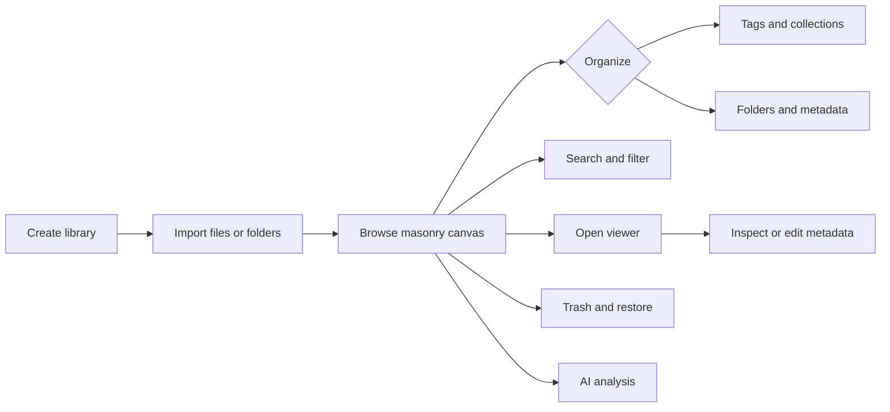

# User Guide

A Super usage guide for end users. Chinese version: [README.md](README.md)

- [Quick start](quick-start.en.md) — install, create a local library, optionally configure AI and appearance
- [Install](installation.en.md) — Windows installation, updates, and other platforms
- [Basics](basics.en.md) — libraries, importing, browsing, organization, file actions, and the viewer
- [Search and filters](search-and-filters.en.md) — advanced query syntax, filter dimensions, and Shift multi-select
- [WebDAV cloud sync](sync.en.md) — server configuration, library binding, auto-sync, opening remote synced libraries
- [AI analysis](ai.en.md) — supported assets, automatic/manual analysis, jobs, and privacy
- [Browser extension](browser-extension.en.md) — save web images/videos from Chrome / Edge / Firefox
- [Using plugins](plugins.en.md) — install, enable, update, and uninstall plugins
- [Automation](automation.en.md) — automation scripts and MCP client connections
- [Troubleshooting](troubleshooting.en.md) — common problems and fixes

## Quick start

1. Download `SuperSetup.exe` from the [latest release](https://github.com/aimtowin/Super/releases/latest) and install it.
2. Create a library on a local disk; an SSD is recommended.
3. Optionally configure **Settings → AI** and **Settings → Appearance**.
4. Import assets or link an existing folder, then browse and organize. Double-click to open the viewer; right-click for more actions.

Super Lib is free. Third-party AI providers may charge separately. See the [quick start](quick-start.en.md) for details.

Data stays in your local library directory; for syncing across machines, use WebDAV cloud sync (see [Sync](sync.en.md)).

## Interface at a glance

A typical workspace has library navigation on the left, the asset canvas in the center, and the Inspector on the right. On Windows, the upper-left Main menu contains File, Edit, Window, Library, and Settings; macOS also exposes the same commands in the native menu. Import, search, filtering, and sorting stay in the top toolbar.

See [Basics](basics.en.md) for the complete workflow.

## Documentation status

This directory describes the current user-facing product. Screens and available features can change between releases; follow the latest installer and release notes.
