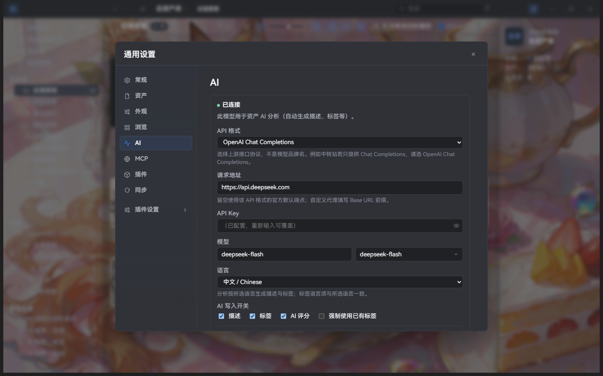
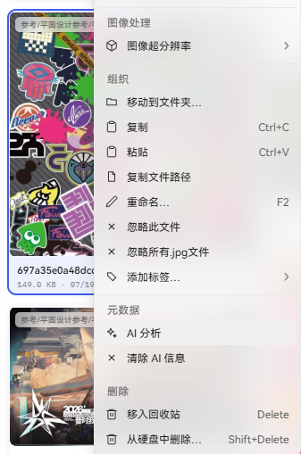
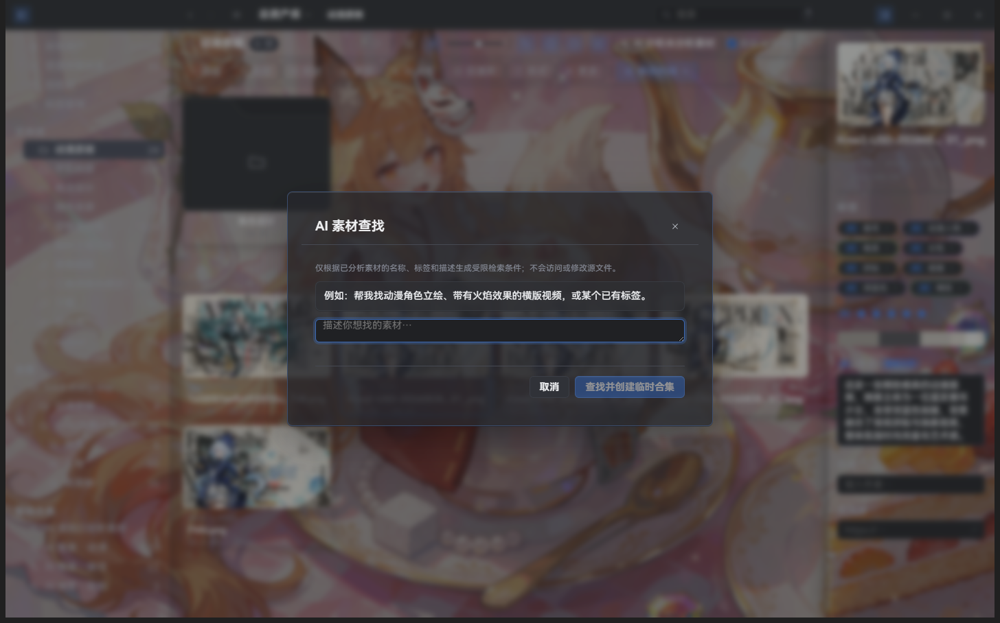
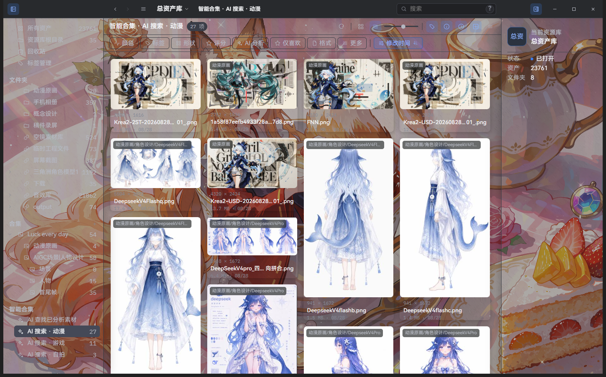

# AI 分析

> 适用版本：Super Lib v2.2.8；安装包可用性以发行附件为准。 标为“旧版参考”的图片可能显示早期布局，请以当前正文为准。

Super 的 AI 分析需要连接你自己的云端 AI 服务。你需要准备服务商账号、API Key、支持图像输入的模型，并确认服务费用。

## 配置

Windows 从左上角 `主菜单 → 设置 → AI` 打开，macOS 从系统菜单打开 `设置 → AI`。

图中的服务地址和模型是截图实例的现有配置，不代表推荐或所有服务商的通用填写方式；请以自己的服务商配置为准。

### 连接服务

- `API 格式` 选择服务商的接口类型，可选 `DashScope Multimodal (native)`、`OpenAI Chat Completions`、`OpenAI Responses`、`Anthropic Messages`、`Gemini Native`。使用中转站时按中转站的接口说明选择。
- `请求地址` 通常可以留空；使用中转站或自建网关时，填写服务商提供的地址。DashScope 原生接口使用 `/api/v1`。
- `API Key` 粘贴服务商生成的密钥。眼睛图标可以暂时查看；保存后不会显示完整密钥，需要更换时重新输入。
- `模型` 填写服务商提供的视觉模型名称。输入有效密钥后可以读取模型列表，读取失败时直接手动填写。
- `语言` 是单选项，可选中文、English、日本語或 한국어；描述和标签会使用所选语言。
- 点击 `测试连接`，成功后点击 `保存配置`。

不要把 API Key 写入脚本、插件、截图、问题反馈或 MCP 配置。

### AI 写入开关

- `描述`：生成画面内容、风格和氛围说明。
- `标签`：生成类型、风格、主题和视觉特点关键词。
- `AI 评分`：按照评分标准生成 1–5 分的参考评分。
- `强制使用已有标签`：只从当前已有标签中选择，不新增标签。

AI 内容与人工内容分开保存，人工描述、标签和评分不会被覆盖。

### 高级设置

- `并发分析上限`：默认 16，范围 1–32；遇到服务商限流时调低。
- `分析图像最大边长`：默认 2048 px，范围 512–4096；只会缩小，不会放大。
- `最大标签数`：默认 8，范围 1–32。
- `中文描述上限`：默认 100 字，范围 20–500。
- `英文描述上限`：默认 60 词，范围 10–200。
- `输出风格`：`正常`、`精简`、`严谨`。
- `评分标准`：说明 1–5 分分别代表什么。
- `自定义描述提示词`：补充描述重点，例如“重点说明构图和光线”。
- `自定义标签提示词`：约束标签分类。不要在提示词中写密钥或其他秘密。

### 自动分析

接受免责声明并打开 `新增资产自动进行 AI 分析` 后，新导入的图像、视频和 3D 模型会在后台分析；该开关默认关闭，关闭它不会删除已有 AI 内容。

## 支持的资产

- 图像和 RAW：发送缩放后的图像。
- 视频：发送带时间标记的联系表，不上传原始视频。
- 3D 模型：发送四视图图像。
- 音频、文本和其他不支持的格式：不会进入 AI 分析。

## 手动分析和结果

在资产右键菜单选择 `AI 分析`，也可以对多选资产使用批量操作。`AI 分析未分析项` 会跳过已有结果；需要重新分析时使用普通的 `AI 分析`。

结果显示在资产 Inspector 的 AI 区域。重新分析的新结果会先等待确认，接受后才替换当前 AI 结果；清除 AI 内容不会删除人工内容或标签实体。

## AI 素材查找

从左侧智能合集区域打开 AI 素材查找，输入想找的内容。应用让已配置的 AI 服务解释检索条件，再在本地已分析素材中执行筛选；结果可以保存为智能合集，也可以丢弃临时合集。它依赖已有分析结果，不会因为一次查找自动分析整个资源库。

下图展示资源库中已保存的「AI 搜索 · 动漫」智能合集，不是上图空白查询产生的结果。

## 任务和失败处理

从 `窗口 → 后台任务` 查看排队、运行、暂停、失败和已完成的 AI 任务，可暂停、继续、取消和重试失败项。网络、限流和超时通常可以直接重试；配置、权限、额度或文件格式问题需要先修正。

视频联系表或缩略图未就绪时，先在后台任务中重试媒体生成，再重试 AI。失败提示会显示简短原因。

## 隐私和费用

Super Lib 本身免费，第三方 AI 服务可能收费。分析会发送受支持资产的图像或预览；AI 查找会向所选服务发送查询文字及构建检索计划所需的上下文。整个资源库不会作为一次查找的素材包上传，实际筛选在本地执行。启用前请确认服务商的隐私条款和费用。
