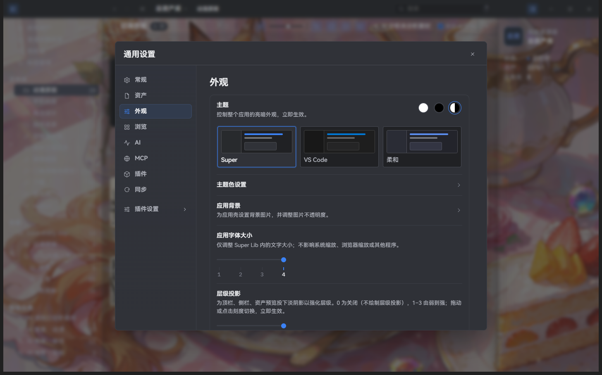
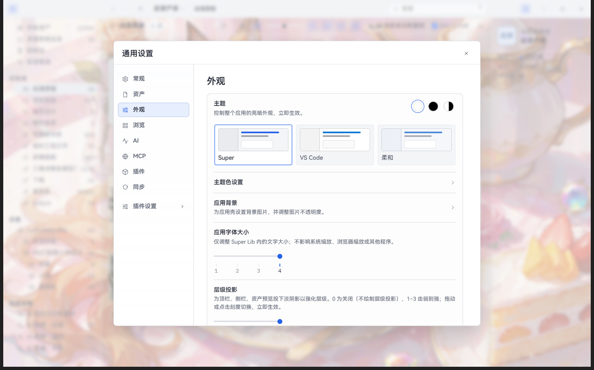
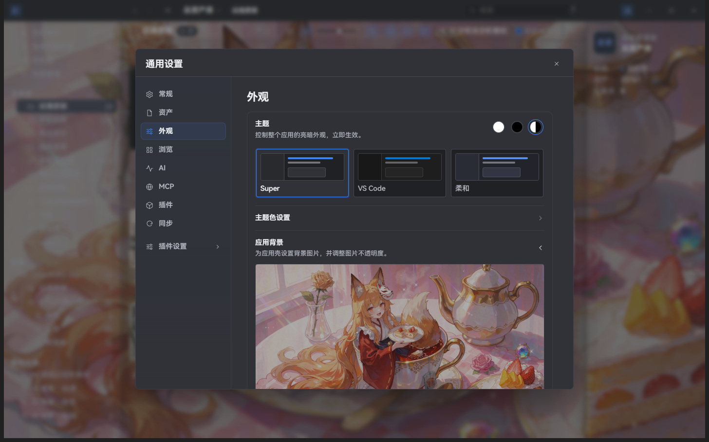

# 外观设置

> 适用版本：Super Lib v2.2.8；安装包可用性以发行附件为准。

[English](appearance.en.md) · [使用手册](README.md)

从「主菜单 → 设置 → 外观」进入。设置即时生效，可以一边调整一边观察界面。

## 主题与明暗模式

右上角三个圆形按钮分别选择浅色、深色、跟随系统。下方的 Super、VS Code、柔和卡片用于选择主题样式；「主题色设置」用于进一步调整颜色。

## 应用背景

展开「应用背景」，查看背景预览并按界面选项更换图片、调整不透明度。背景较复杂时，可以降低其可见程度，让文件名和工具栏更容易阅读。

## 字体大小与层级效果

- 「应用字体大小」为 `1`–`4` 四档，仅改变 Super Lib 内的文字，不改变 Windows 或其他应用的缩放。
- 「层级投影」控制面板间的阴影强度。
- 向下滚动可找到右键菜单亚克力设置，用于调整菜单的透明和模糊效果。

截图中字体为第 4 档，这是截图实例的用户设置，不代表安装后的默认值。
