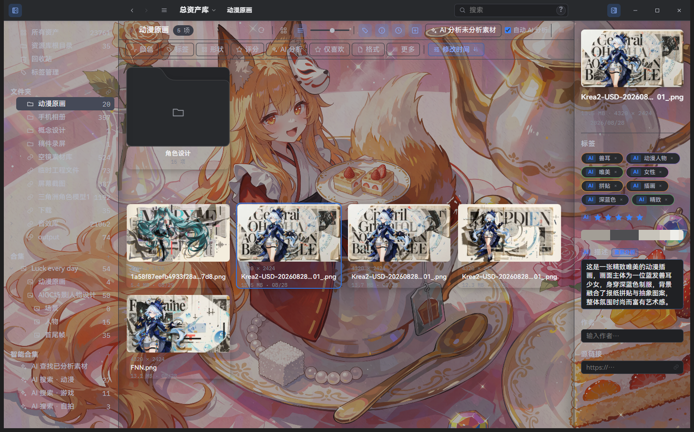
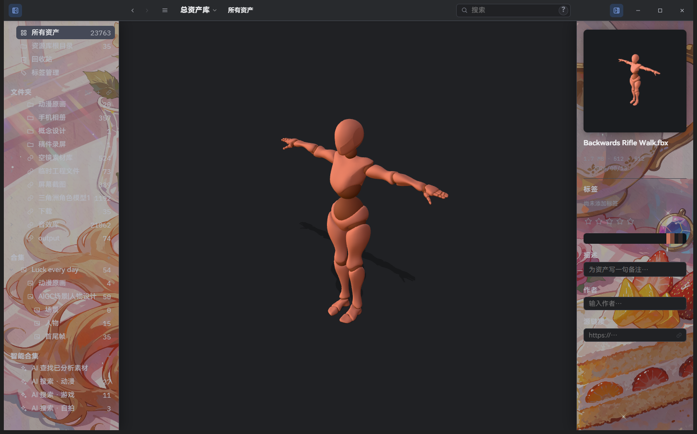

# Basics

> Applies to Super Lib v2.2.8; package availability follows release attachments.

## Create, open, and configure a library

On first launch choose **Create library**, pick a location, and enter a display name. A library contains managed assets, its database, and a `.super/` working directory. The display name does not move the library directory.

Use the upper-left **Main menu → Library** to create, open, or import libraries. **Library settings** lets you rename the current library, see its location, and edit its ignore configuration.

The ignore editor uses one rule per line, similar to `.gitignore`; the UI calls it an “ignore configuration file”. Saving immediately affects browsing, search, and scanning:

```text
# Ignore temporary files
*.tmp
# Ignore draft files, then keep one file
references/drafts/*
!references/drafts/keep.png
```

The `?` help explains `*`, `?`, `**`, a trailing `/` for directories, a leading `/` for library-root rules, and `!` negation.

### Open external libraries (Eagle / Billfish)

**Open library** → **Open external library…** → choose **Eagle** or **Billfish**:

1. Pick the source library (an Eagle/Billfish library folder or its archive);
2. choose where Super should create the local library;
3. Super converts the source and creates a local library at the destination (a large Eagle library can take several minutes on first conversion).

After conversion, browsing, search, tags, AI analysis, and everything else work exactly like a local library, and the original files are left untouched.


## Import assets

Drop one or more files, folders, or a mixed selection into Super, or use **Import files** / **Import folder**. Folder imports are recursive. For web assets you have permission to save, download them with your browser first, then import the local files.

The current product registry includes:

- Images: PNG, JPG/JPEG, GIF, TIFF/TIF, WebP, SVG, BMP, ICO, PSD, EXR, TGA
- Camera RAW: RAW, DNG, CR2, CR3, NEF, ARW, RAF, ORF, RW2
- Video: MP4, MOV, AVI, WMV, WebM, MKV, M4V
- Audio: WAV, MP3, OGG/OGA, M4A, AAC, FLAC, Opus (waveform cover plus playback)
- 3D: FBX, OBJ, GLTF, GLB, STL (FBX is converted to a viewable GLB)
- Text: TXT, Markdown, JSON, CSV, XML, YAML, and common source/config formats
- Documents: PDF and HTML/HTM; preview behavior depends on document type

Formats without a built-in image preview, such as ZIP and EXE, display extension thumbnails that follow the active theme. Such a thumbnail does not itself indicate a corrupt file.

Super copies managed files into the library and assigns a stable asset ID. Name or content duplicates open a conflict dialog. Thumbnails and technical metadata are generated in the background. Automatic AI analysis only runs when configured and enabled; you can browse while background work continues.

#### Sequence-frame import

In **Settings → Assets**, turn **Detect image sequences during import** on or off (on by default). When enabled, dropping or importing consecutively numbered, same-size images (for example `00001.png`…`00150.png`) opens the sequence import dialog, where you can set the FPS. When disabled, the files are imported as ordinary images. A sequence appears as one playable asset in the viewer and can be dissolved back into individual frames.

In the dialog, adjust the frame range and FPS, then choose whether to import only the current file or the selected frames as a sequence.

## Browse and organize

- Sidebar: All assets, Trash, folders, collections, and smart collections. Folders and collections can include descendants; a collection is a many-to-many relationship, so an asset may belong to several collections.
- Canvas: tile, masonry, and folder/collection cards. Resizing sidebars or card size reflows the layout while preserving the approximate scroll position.
- Toolbar: search, filters, sorting, view, and card fields. In non-grid pages, irrelevant view controls are hidden.
- Inspector: file information, tags, rating, favorite, description, source URL, author, technical metadata, color space, and AI content.

Click to select and double-click to open the viewer. Drag on empty canvas space to marquee-select; use `⌘` on macOS or `Ctrl` on Windows while clicking to add to a selection. `Tab` moves focus between assets; `Shift` enables range selection where supported. Folders, collections, and smart collections support context-menu actions, inline `F2` rename, and `Delete`; deleting a non-empty container confirms first, and deleting a collection never deletes its assets.



### Create a root-level folder

A new folder normally becomes a child of the selected folder. To create at the root, double-click a passive title-bar area outside buttons and inputs. This resets the sidebar's creation target to the root while keeping the current view and open preview. Clicking or dragging the title bar does not trigger this change.

Folders and All assets render progressively in pages. Sidebar counts, exact totals, and previews may update later. The indeterminate loading bar means a result is pending, not a measured completion percentage.

## Viewer

Double-click an asset to open the viewer. Images, SVG, RAW, PSD, TIFF, TGA, and EXR use their decoder or a generated derivative; SVG is rendered from its vector source in the viewer, not treated as the thumbnail. Videos loop by default and may use a Super-generated compatible proxy. Audio shows a waveform and playback controls. 3D models use the dedicated model viewer. PDF files render page-by-page in the built-in pdf.js viewer.

The viewer supports pan, wheel zoom, fit-to-view (numpad `.`), fullscreen, and rotate/horizontal/vertical mirror transforms for images and video. PDF preview supports zoom (0.25×–8×), pan, and fit-to-page; scrolling zooms around the mouse pointer. For formats other than PNG/JPEG, Super uses a detected color space when available and lets you choose among supported spaces. EXR can expose multiple planes/parts when present; this is not a professional channel-grading tool.



## Tags, collections, and smart collections

- Add tags from the Inspector or an asset context menu. The tag picker supports search, recent tags, and batch operations.
- Collections are manually maintained relationships. Drag assets into a collection or use the **Add to collection** submenu; removing an asset from a collection only removes the relationship.
- Smart collections save a search, filter, and sort definition and calculate results live.

## Trash and deletion

Normal `Delete` / macOS `⌘⌫` moves an asset or folder to Trash. Windows `Shift+Delete` and macOS `⌥⌘Delete` delete from disk after a confirmation. The undo icon in the notification can reverse the most recent undoable file operation and refreshes the current view.

## Linked folders

**Import linked folder** in the **File** menu references a real folder outside the library (such as a project or material directory). Assets are not copied into the library; they are referenced in place in their original folder. You can later copy a linked folder into the library (making it managed), relink it, or set rules for it.

## WebDAV cloud sync

Super can sync a library across machines over WebDAV: configure servers globally, bind each library, set auto-sync and the poll interval, and open remote synced libraries. See [Sync and external libraries](sync.en.md).

## Shortcuts

| Action | macOS | Windows |
| --- | --- | --- |
| Open viewer | Enter | Enter |
| Open in external app | ⌘O | Ctrl+O |
| Reveal in file manager | ⌘⇧S | Ctrl+Shift+S |
| Focus search | ⌘F | Ctrl+F |
| Rename | F2 | F2 |
| Move to Trash | ⌘⌫ | Delete |
| Delete from disk | ⌥⌘Delete | Shift+Delete |
| Copy / Paste | ⌘C / ⌘V | Ctrl+C / Ctrl+V |
| Fit viewer | Numpad `.` | Numpad `.` |

See [Search and filters](search-and-filters.en.md) for query examples and [AI analysis](ai.en.md) for AI setup and jobs.
