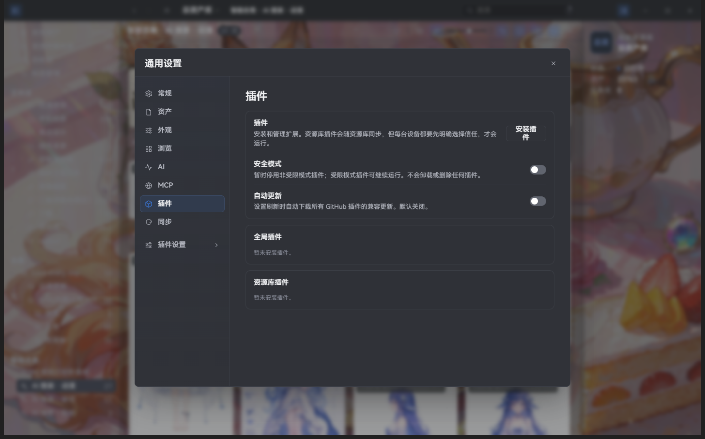

# Plugin features

> Applies to Super Lib v2.2.8; package availability follows release attachments.

Plugins add tools, menus, or workflows to Super. They are not ordinary library assets and can be enabled or disabled at any time.

## Install a plugin

1. Open **Settings → Plugins** and choose Install.
2. Choose a local folder, a local ZIP, or a GitHub address.
3. For a GitHub plugin, paste the complete project address supplied by the project team or plugin author. For example:

   `https://github.com/<owner>/<repository>`

4. Choose **User-wide** or **This library**. A user-wide plugin is available in every library; a library plugin is used only in the current library.

The plugin appears in the plugin list after installation. Follow the plugin author’s own instructions if it needs additional setup.

## Enable and disable

- Turn on **Enable** on the plugin card.
- The first time you enable a library plugin, Super asks whether you trust it. Only approve a source you trust.
- Turn **Enable** off whenever you do not need the plugin.
- Click **Reload** after changing plugin settings; Super does not need to restart.

If the same plugin is installed both user-wide and in the library, the plugin list shows which version is active and lets you switch or disable it.

## Update and uninstall

GitHub plugins can check for updates from plugin settings. Automatic updates are off by default; confirm the source before enabling them.

Uninstalling a plugin does not remove personal settings it may have saved. Reinstall it later if you want to keep those settings; if the plugin provides its own cleanup action, prefer that action.

## If a plugin does not work

Check that it was installed in the intended scope, then reopen plugin settings. If it still does not work, contact the plugin author with your Super version, operating system, and plugin name. Never include an API key or other private data in a report.

Developers should read the [extension author manual](../manual/README.md).
