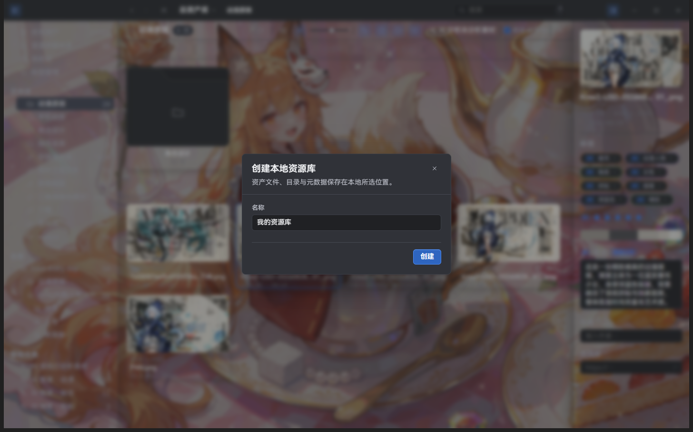
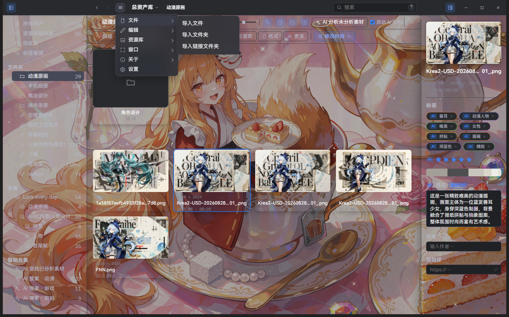

# 快速上手

> 适用版本：Super Lib v2.2.8；安装包可用性以发行附件为准。

[English](quick-start.en.md) · [使用手册](README.md) · [下载最新版](https://github.com/aimtowin/Super/releases/latest)

Super Lib 完全免费。先创建一个本地资产库，就可以开始管理素材；AI 和外观配置都可以稍后再做。

## 1. 下载并安装

在 [GitHub Release](https://github.com/aimtowin/Super/releases/latest) 下载 `SuperSetup.exe`，运行安装程序并按提示完成。当前 `v2.2.8` 提供 Windows x64 安装包。

首次安装选择 EXE 即可。发布页里的完整更新 ZIP、增量 ZIP 和 SHA-256 文件是更新及校验附件，不需要全部下载。

## 2. 创建本地资产库

启动应用，选择创建资源库，在本机磁盘中选择一个适合长期保存素材的位置。

已有资源库打开时，也可以从「主菜单 → 资源库 → 新建资源库」进入。填写名称后，按提示选择本机保存位置。

- 建议使用固态硬盘，尤其是准备管理大量素材时。
- 为素材、缩略图和其他预览缓存预留空间。
- 记住自己选择的库目录，便于后续打开与备份。

资产库创建完成后，就可以直接使用浏览和整理功能。

## 3. 按需配置 AI 与外观

打开「主菜单 → 设置 → AI」，填写所选服务商的接口、模型和 API Key，测试连接并保存。具体说明见 [AI 分析与查找](ai.md)。不配置 AI 也可以导入、浏览、筛选和整理素材。

AI 服务由你自行选择，第三方可能收费。启用分析时，应用会向所选服务发送用于分析的图像或预览；请在处理私人素材前了解该服务的数据处理方式。

打开「主菜单 → 设置 → 外观」，选择深浅主题，调整主题色、自定义背景、背景透明度和字体大小。字体大小只有 `1`–`4` 四档，仅影响应用内文字。

外观界面与详细说明见[外观设置](appearance.md)。

## 4. 放入第一批素材

可以先用一小组素材熟悉操作，再加入自己的完整素材目录。

| 方式 | 适合什么情况 | 文件保存在哪里 |
| --- | --- | --- |
| 导入文件或文件夹 | 希望由 Super Lib 保存一份素材副本 | 复制到资产库中 |
| 链接文件夹 | 希望继续沿用已有素材目录 | 保留在原位置，由资产库引用 |

导入可以使用菜单或将文件拖入窗口；链接目录可以使用左侧文件夹区域的链接入口。链接后，原目录和磁盘需要保持可访问；原文件被移动或删除也会影响链接资源。

「主菜单 → 文件」中也提供「导入文件」「导入文件夹」和「导入链接文件夹」三个入口。

## 5. 开始探索

左侧切换文件夹和合集，中间浏览素材，右侧查看资源信息。双击素材打开查看器，右键查看可用操作。

- 用顶部的颜色、标签、格式等筛选条件缩小范围，见[搜索与过滤](search-and-filters.md)。
- 用标签和合集组织素材，见[基本使用](basics.md)。
- 配置 AI 后可以分析素材，再使用自然语言查找已分析素材，见 [AI 分析与查找](ai.md)。

## 遇到问题

在 [GitHub Issues](https://github.com/aimtowin/Super/issues) 提交 Bug，或通过作者发布 Super Lib 的社媒平台反馈。请说明应用版本、系统版本、操作步骤、预期结果和实际结果；截图或错误提示能帮助定位问题。不要附上 API Key 或私人素材。

常见问题见[故障排查](troubleshooting.md)。
