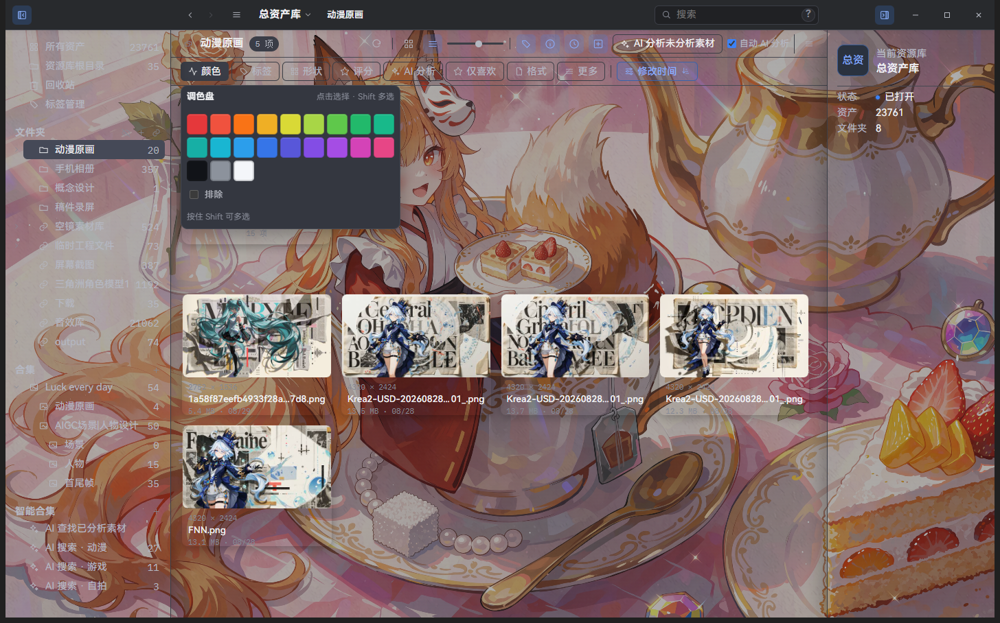

# Search and filters

> Applies to Super Lib v2.2.8; package availability follows release attachments.

Click **Color** above the asset canvas to open the palette. Shift-click selects multiple colors; **Exclude** excludes the selected colors.



## Scope and updates

Search runs only in the current browse scope: the current folder/collection, the include-descendants choice, and active structured filters define the candidate set. Typing updates the result after about 200 ms; press Enter to submit immediately. Results load progressively in pages.

Search covers file name, tags, description (including AI description), source URL, author, folder path, and searchable metadata. Plain terms are case-insensitive substring matches.

## Advanced query syntax

Hover or keyboard-focus the `?` beside the search field for the in-app reminder. Queries are made of small terms:

| Syntax | Meaning | Example |
| --- | --- | --- |
| space | AND within one group; every term must match | `poster blue` |
| `\|` | OR; any group may match | `poster \| cover` |
| leading `-` | Exclude a condition | `-tag:draft` |
| double quotes | Keep spaces and `\|` inside a phrase | `"hero concept"` |
| `field:value` | Search only one field | `author:Jane` |

Field aliases:

- File name: `name:` or `filename:`
- Tags: `tag:` or `tags:`
- Description: `desc:` or `description:`
- Source URL: `source:`, `url:`, `link:`, or `source_url:`
- Author: `author:`
- Folder path: `path:`, `folder:`, or `folder_path:`
- Metadata: `meta:`, `metadata:`, or `metadata_text:`

Example:

```text
name:"hero concept" -tag:sketch | author:Jane
```

This means “the file name contains hero concept and is not tagged sketch, or the author is Jane”. Without a field prefix, all searchable fields are searched. Width, height, long edge, and duration are structured filters, not search operators.

## Filters

Use the separate Color, Tags, Shape, Rating, AI analysis, Favorites, Format, and More controls above the asset canvas. Different dimensions combine with AND; multiple values within one dimension combine with OR. Available dimensions include:

- Color: 18 hue ranges plus black, gray, and white, totaling 21 swatches; matches representative palette colors rather than only the dominant color
- Tags: searchable tags, top tags, and recently used filters
- Shape: landscape/portrait, 16:9, 4:3, 1:1, 3:4, 9:16 presets, plus a custom aspect ratio
- Rating: unrated through five stars
- AI analysis: analyzed or unanalyzed assets
- Favorites: a shortcut to favorite assets
- Format: image, video, audio, 3D, text, and individual extensions
- More: favorite, source URL present/absent, availability (available/missing), long-edge buckets, width, height, and duration ranges

Hold **Shift** while clicking color, tag, rating, format, or shape-preset values to OR-select several values in one dimension. Shift-click an active value again to remove it. A normal click replaces that dimension’s selection; clicking its only selected value clears it. Different dimensions remain ANDed. Boolean and numeric fields in **More** are independent fields, not a list of discrete values.

The bottom of the filter popover repeats “Hold Shift to multi-select”. Active conditions appear as removable chips; **Clear all** resets every filter.

## Sorting and smart collections

Sort by name, modified time, created time, file size, resolution, duration, rating, color, or author, ascending or descending; shuffle is also available. A search, its filters, and its sort can be saved as a smart collection. Smart collections recalculate when opened, so their results follow library changes.
