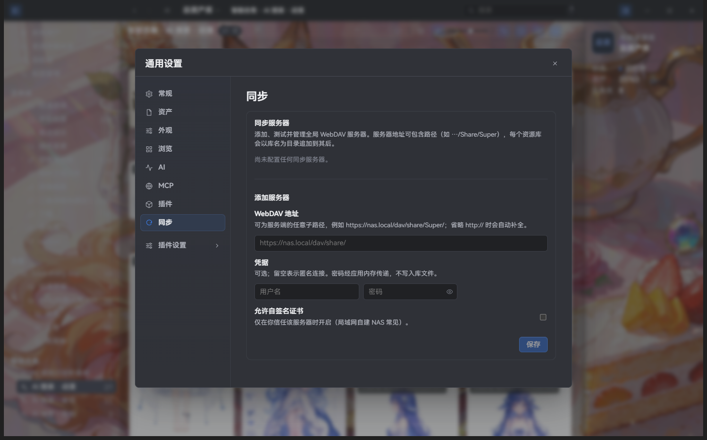
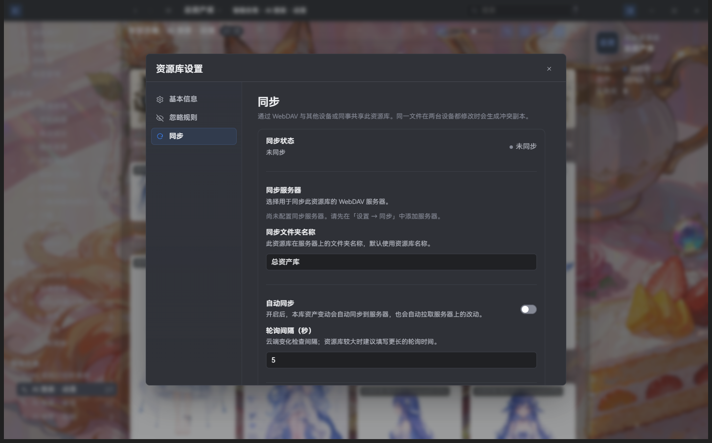
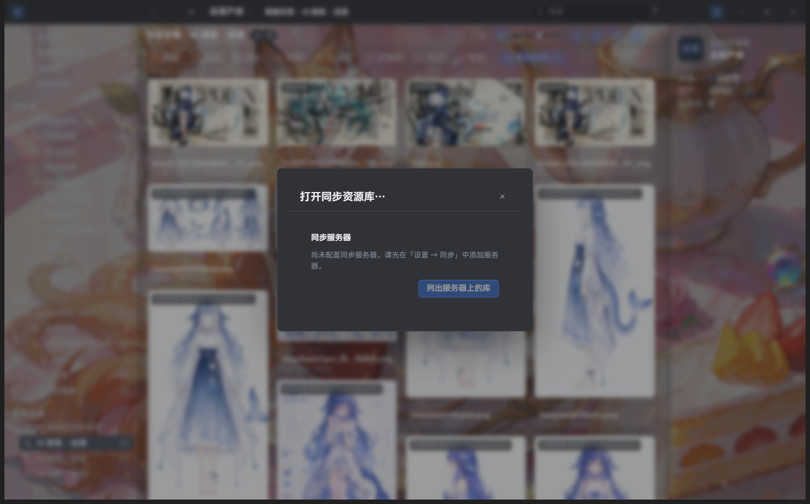

# WebDAV Cloud Sync

> Applies to Super Lib v2.2.8; package availability follows release attachments.

Super Lib can sync a library across machines over WebDAV. Configure servers globally, bind each library individually, and Super syncs both ways automatically: local changes upload, remote changes pull.

The screenshots below were captured from the current Super Lib instance, with no server configured; they show setup entry points, not a completed sync. Sync propagates edits and deletions and is not an independent backup. Back up your library first and verify your server and devices with a small test library before syncing important assets.

## Sync overview

- Configure one or more WebDAV servers in **General settings**; each library binds to one server and a remote folder.
- Sync is bidirectional: local imports, edits, and deletions upload automatically; remote changes are pulled to the local library.
- Auto-sync is per library: after saving a binding it runs once immediately, then checks the server for changes on the configured poll interval; local asset changes upload about 10 seconds after they happen.
- A toast appears in the bottom-right while syncing or when sync completes; the library switcher (top-left, next to the library name) shows a connection icon — green link = auto-sync on, grey link-off = off (hover for details).

## Configure a WebDAV server (General settings)

Open **General settings** → **Sync** to add a sync server:

- **Server address**: use the WebDAV path of your NAS or shared folder, for example `https://nas.local/dav/share/`. Prefer an explicit `https://` prefix. Omitting the protocol adds `http://`; HTTP does not encrypt network traffic.
- **Username / password**: server credentials. The password is encrypted with the system secure storage (macOS Keychain / Windows DPAPI) and never stored in plain text.
- **Allow self-signed certificate**: enable only for a server whose identity you trust. This setting relaxes TLS certificate verification; it does not encrypt HTTP traffic.
- After saving you can test the connection; failures show an actionable reason (invalid address, DNS, TLS, authentication, …).

## Bind a library (Library settings)

Open **Library settings** → **Sync**:

- **Sync status**: shows not synced / syncing / last synced time.
- **Server**: the server this library binds to; switching servers tests the connection automatically.
- **Sync folder name**: the remote folder name, defaults to the library name. The remote location is `server address/folder name/`.
- **Auto sync**: when on, local changes upload and remote changes pull automatically.
- **Poll interval (seconds)**: how often remote changes are checked, 5 seconds by default. **For large libraries, consider a longer interval** to avoid frequent checks weighing on the network and disk.
- **Save**: persists the binding; turning auto-sync on triggers a sync immediately.

## Sync behavior

- A first sync to an empty remote directory uploads assets, metadata, and a manifest. An existing remote directory is compared with local state and may require downloads or conflict handling. Later syncs primarily transfer changed content.
- If two machines edit the same file, the losing version is kept as a “name (conflict-…)” copy instead of being silently overwritten.
- Auto-sync and manual sync are mutually exclusive. Background auto-sync failures are logged; check the interface for failures from manual actions.

## Open a synced library

**Open library** → **Open synced library…**:

1. Choose a configured server;
2. the panel lists synced libraries on that server (recognized by their remote manifest, so you can continue on another device);
3. pick a local destination and open — remote content is downloaded locally.

The server must provide WebDAV operations including PROPFIND, MKCOL, GET, PUT, and DELETE. Connection testing also checks capabilities such as MOVE. A plain HTTP download address is not a WebDAV server.

